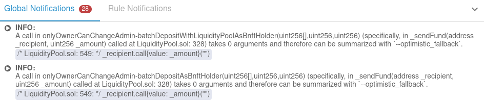
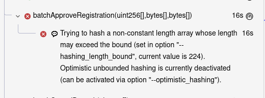
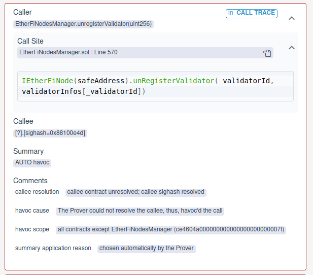
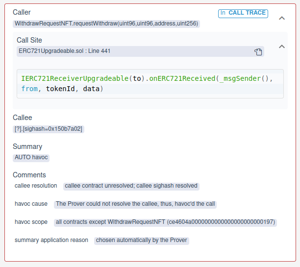
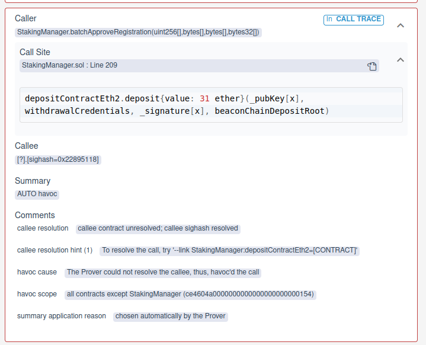
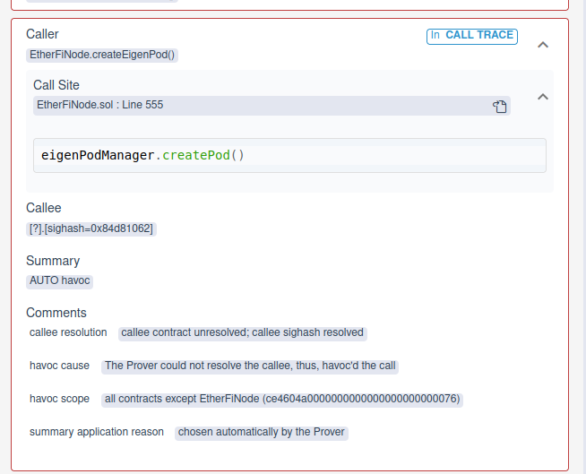

.. _liquidity_pool_linked_initial:

Liquidity pool linked setup
===========================

* Here we describe how to create a setup for the :solidity:`LiquidityPool` using linking.
* Note we do not attempt to fully resolve all unresolved calls, but mainly those that
  violate the :cvl:`onlyOwnerCanChangeAdmin` rule.

Parametric contracts
--------------------
* We're adding more contracts to the scene.
* By default, parametric rules and invariants will run on *all* functions from
  all these contracts.
* This can cause long running times.
* To limit the contracts used in parametric rules and invariants, use the
  ``parametric_contracts`` option, see `Parametric contracts`_. This can be *unsound*.
* For training we will only use the :solidity:`LiquidityPool` as a parametric contract.

.. code-block:: json

   "parametric_contracts": ["LiquidityPool"],

.. warning:: Limiting the parametric contracts can be *unsound*.

----

Initial linked contracts
------------------------

.. include:: graphs/initial_links.rst

Configuration
^^^^^^^^^^^^^

.. literalinclude:: ../../../confs/liquidity/links_initial.conf
   :language: json
   :caption: :clink:`Config file</certora/confs/liquidity/links_initial.conf>`

* Report: `linked pool initial config report`_.

----

Optimistic settings
-------------------

Optimistic fallback
^^^^^^^^^^^^^^^^^^^
* In the report the Prover suggests using ``optimistic_fallback``, see image below.
* This will prevent unresolved calls to fallback from arbitrarily changing storage
  of contracts (*havocing*).
* See `Optimistic fallback`_.

.. warning::

   Using optimistic fallback implies you assume fallback functions will not change
   storage.

----

Optimistic hashing
^^^^^^^^^^^^^^^^^^
* Similar to loops unrolling, the Prover "unrolls" hashed arrays, if the array is
  too long it reports a violation.
* To avoid this case use ``optimistic_hashing`` which will cause the Prover to
  *assume* that the hashed arrays length is at most ``hashing_length_bound``.
* See `Optimistic hashing`_ and `Modeling of Hashing in the Certora Prover`_.

.. warning::

   Like all assumptions, using ``optimistic_hashing`` may be unsound.

----

Optimistic report
^^^^^^^^^^^^^^^^^
* Report using the optimistic settings: `linked pool optimistic report`_.
* This report still has violations due to havoc'd calls.
* We resolve these below.

----

.. _unresolved_etherfinode_calls:

Unresolved calls to EtherFiNode
-------------------------------

Example
^^^^^^^
* The unresolved call below is from the call trace of :solidity:`batchCancelDeposit`
  from `linked pool optimistic report`_.
* This call *havocs* the storage of all contracts except for
  :solidity:`EtherFiNodesManager`.
* In particular, it affects the storage of the :solidity:`LiquidityPool`, and violates
  the rule.

.. literalinclude:: ../../../../src/EtherFiNodesManager.sol
   :language: solidity
   :lines: 566-578
   :emphasize-lines: 5
   :caption: :clink:`EtherFiNodesManager line 570</src/EtherFiNodesManager.sol>`

Simple solution
^^^^^^^^^^^^^^^
.. dropdown:: Simple solution

   * Add :clink:`EtherFiNode</src/EtherFiNode.sol>` to the scene.
   * Use dispatcher on all non-view :solidity:`EtherFiNode` functions.
   * Spec realizing this solution:
     :clink:`linked_node.spec</certora/specs/liquidity/linked_node.spec>`.
   * Configuration: `linked_node.conf<//certora/confs/liquidity/linked_node.conf>`.
   * Report: `using a single EtherFiNode report`_.

Better solution
^^^^^^^^^^^^^^^
.. dropdown:: Better solution

   * Create several contracts inheriting from :clink:`EtherFiNode</src/EtherFiNode.sol>`
     and add them to the scene.
   * Use dispatcher on *all* :solidity:`EtherFiNode` functions.

----

.. _unresolved_call_to_erc721:

Unresolved call to IERC721ReceiverUpgradeable
---------------------------------------------

Example
^^^^^^^
* The unresolved call below is from the call trace of :solidity:`requestWithdraw`
  (from `linked pool optimistic report`_).
* This call *havocs* the storage of all contracts except for
  :solidity:`WithdrawRequestNFT`.

.. dropdown:: Call trace in code

   .. literalinclude:: ../../../../src/LiquidityPool.sol
      :language: solidity
      :lines: 237-250
      :emphasize-lines: 9
      :caption: :clink:`LiquidityPool.requestMembershipNFTWithdraw</src/LiquidityPool.sol>`
   
   .. literalinclude:: ../../../../src/WithdrawRequestNFT.sol
      :language: solidity
      :lines: 57-66
      :emphasize-lines: 6
      :caption: :clink:`WithdrawRequestNFT.requestWithdraw</src/WithdrawRequestNFT.sol>`
   
   .. literalinclude:: ../../../../lib/openzeppelin-contracts-upgradeable/contracts/token/ERC721/ERC721Upgradeable.sol
      :language: solidity
      :lines: 267-277
      :emphasize-lines: 8
      :caption: :clink:`ERC721Upgradeable</lib/openzeppelin-contracts-upgradeable/contracts/token/ERC721/ERC721Upgradeable.sol>`
   
   .. literalinclude:: ../../../../lib/openzeppelin-contracts-upgradeable/contracts/token/ERC721/ERC721Upgradeable.sol
      :language: solidity
      :lines: 434-456
      :emphasize-lines: 8
      :caption: :clink:`ERC721Upgradeable</lib/openzeppelin-contracts-upgradeable/contracts/token/ERC721/ERC721Upgradeable.sol>`

Solution
^^^^^^^^
.. dropdown:: Solution

   * Add a mock to the scene, e.g.
     :clink:`ERC721ReceiverMockUpgradeable</lib/openzeppelin-contracts-upgradeable/contracts/mocks/ERC721ReceiverMockUpgradeable.sol>`.
   * Use :cvl:`DISPATCHER(true)` for the call to :solidity:`onERC721Received`.

----

.. _unresolved_call_to_idepositcontract:

Unresolved calls to IDepositContract
-------------------------------------

Example
^^^^^^^
* The unresolved call below is from the call trace of :solidity:`batchApproveRegistration`
  from `using a single EtherFiNode report`_.
* This call *havocs* the storage of all contracts except for
  :solidity:`StakingManager`.

.. dropdown:: Call trace in code

   .. literalinclude:: ../../../../src/LiquidityPool.sol
      :language: solidity
      :lines: 359-378
      :emphasize-lines: 19
      :caption: :clink:`LiquidityPool.batchApproveRegistration</src/LiquidityPool.sol>`
   
   .. literalinclude:: ../../../../src/StakingManager.sol
      :language: solidity
      :lines: 194-211
      :emphasize-lines: 16
      :caption: :clink:`StakingManager.batchApproveRegistration</src/StakingManager.sol>`
   
   .. literalinclude:: ../../../../src/StakingManager.sol
      :language: solidity
      :lines: 49-51
      :emphasize-lines: 2
      :caption: :clink:`StakingManager.depositContractEth2</src/StakingManager.sol>`
   
   .. literalinclude:: ../../../../src/interfaces/IDepositContract.sol
      :language: solidity
      :lines: 9-39
      :emphasize-lines: 1
      :caption: :clink:`IDepositContract</src/interfaces/IDepositContract.sol>`

Solution
^^^^^^^^
.. dropdown:: Solution

   * Use a mock :clink:`ETHDepositMock</test/eigenlayer-mocks/ETHDepositMock.sol>`.
   * Note this file requires Solidity 0.8.12 compiler -- use ``solc_map``,
     see :clink:`linked_node_mocks.conf</certora/confs/liquidity/linked_node_mocks.conf>`.
   * Report: `using mocks report`_.

----

.. _unresolved_to_eigenpodmanager:

Unresolved calls to IEigenPodManager
------------------------------------

Example
^^^^^^^
* The unresolved call below is from the call trace of :solidity:`batchDepositAsBnftHolder`
  from `using mocks report`_.
* This call *havocs* the storage of all contracts except for :solidity:`EtherFiNode`.

.. dropdown:: Call trace in code

   .. literalinclude:: ../../../../src/LiquidityPool.sol
      :language: solidity
      :lines: 268-272, 314-332
      :caption: :clink:`LiquidityPool.batchDepositAsBnftHolder</src/LiquidityPool.sol>`
   
   .. literalinclude:: ../../../../src/StakingManager.sol
      :language: solidity
      :lines: 134-142
      :emphasize-lines: 8
      :caption: :clink:`StakingManager.batchDepositWithBidIds</src/StakingManager.sol>`
   
   .. literalinclude:: ../../../../src/StakingManager.sol
      :language: solidity
      :lines: 339-367
      :emphasize-lines: 27
      :caption: :clink:`StakingManager._processDeposits</src/StakingManager.sol>`
   
   .. literalinclude:: ../../../../src/StakingManager.sol
      :language: solidity
      :lines: 429-448
      :emphasize-lines: 8
      :caption: :clink:`StakingManager._processDeposit</src/StakingManager.sol>`
   
   .. literalinclude:: ../../../../src/EtherFiNodesManager.sol
      :language: solidity
      :lines: 349-363
      :emphasize-lines: 9
      :caption: :clink:`EtherFiNodesManager.allocateEtherFiNode</src/EtherFiNodesManager.sol>`
   
   .. literalinclude:: ../../../../src/StakingManager.sol
      :language: solidity
      :lines: 248-258
      :emphasize-lines: 8
      :caption: :clink:`StakingManager.instantiateEtherFiNode</src/StakingManager.sol>`
   
   .. literalinclude:: ../../../../src/EtherFiNode.sol
      :language: solidity
      :lines: 552-558
      :emphasize-lines: 4
      :caption: :clink:`EtherFiNode.createEigenPod</src/EtherFiNode.sol>`

Solution
^^^^^^^^
* Ideally we will use an implementation or a mock for :solidity:`IEigenPodManager`.
* However, the function
  :clink:`EigenPodManagerMock.createPod</test/eigenlayer-mocks/EigenPodManagerMock.sol>`
  is empty.
* Instead we'll use a :cvl:`NONDET` summary, though it is *unsound* for non-view
  functions.

.. warning::

   Using a :cvl:`NONDET` summary for non-view functions is *unsound*.

----

Final report
------------
`Final report`_.

.. Links
   -----

.. _Modeling of Hashing in the Certora Prover:
   https://docs.certora.com/en/latest/docs/prover/approx/hashing.html

.. _Optimistic hashing:
   https://docs.certora.com/en/latest/docs/prover/cli/options.html#optimistic-hashing

.. _Optimistic fallback:
   https://docs.certora.com/en/latest/docs/prover/cli/options.html#optimistic-fallback

.. _View summaries:
   https://docs.certora.com/en/latest/docs/cvl/methods.html#view-summaries-always-constant-per-callee-constant-and-nondet

.. _Havoc summaries:
   https://docs.certora.com/en/latest/docs/cvl/methods.html#havoc-summaries-havoc-all-and-havoc-ecf

.. _Parametric contracts:
   https://docs.certora.com/en/latest/docs/prover/cli/options.html#parametric-contracts-contract-name

.. _Call to IEigenPodManager report:
   https://prover.certora.com/output/98279/603d7f041e46446a9afa3755db399741/?anonymousKey=b5ba63525b67eed409cc4ada2ca2529fd039c2b8

.. _Final prev report:
   https://prover.certora.com/output/98279/4ffb8fd67b2c49aba32108dbb925991d?anonymousKey=10848f89d1c1c950e58d7217d787690d48c62638

.. _initial report:
   https://prover.certora.com/output/98279/113b6f56febd4d4a8aa10a399deea45d?anonymousKey=434e8d7793559531458daa309ad06970586b7f96

.. _initial rule report:
   https://prover.certora.com/output/98279/4a8dad63da7143429772b8b07230ce8f?anonymousKey=59a8f064aa6a11672ff953ceb4b6dcc7922278d2

.. _improved initial rule report:
   https://prover.certora.com/output/98279/327e365d45024a9aaaeeb9d825ce360f?anonymousKey=db854e209e815e8abecaeb66d4e4a5e6b974f30f

.. _linked pool initial config report:
   https://prover.certora.com/output/98279/e819a92093fc4b5bb33aa27697deb2bf?anonymousKey=d5cc018d13f6f7cb78c9120815879122a4a96aca

.. _linked pool optimistic report:
   https://prover.certora.com/output/98279/829f59334bcf4dfc9127fb79f62794d4?anonymousKey=af4e8c18baa475d7e1cad3c2a75655a8407c29ea

.. _using a single EtherFiNode report:
   https://prover.certora.com/output/98279/0ca875ca2a594cf887b1e4466813fdc0?anonymousKey=97b82b3431eb934001b978a8898147212de5c714

.. _using mocks report:
   https://prover.certora.com/output/98279/380bd1f4dc874ed282e13d90ed38e98a?anonymousKey=a31fd7b460b1625cc6968e9d7454631fe677e1b9

.. _Final report:
   https://prover.certora.com/output/98279/082d422c27bb4a3a88f8988cd64fc172?anonymousKey=45fa50246a4f6e6e89a2753e670cbdad9d8d0547
