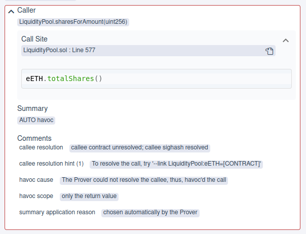
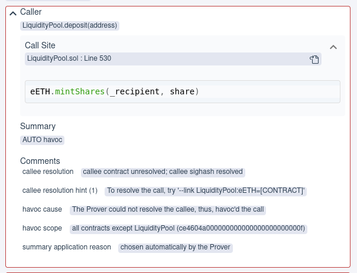

Liquidity pool initial setup
============================

This is the basic setup, we show a more complicated setup in
:ref:`liquidity_pool_linked_initial`.

Basic sanity
------------

Sanity rule and config
^^^^^^^^^^^^^^^^^^^^^^
* For the initial test we'll use only a simple sanity rule.
* Checks sanity of all methods and call resolution.
* Allows us to verify number of iterations.

.. cvlinclude:: ../../../specs/liquidity/initial.spec
   :cvlobject: sanity
   :caption: :clink:`Sanity rule</certora/specs/liquidity/initial.spec>`

The basic initial config is minimal:

.. literalinclude:: ../../../confs/liquidity/initial.conf
   :language: json
   :caption: :clink:`Initial confiig</certora/confs/liquidity/initial.conf>`

Report
^^^^^^
* Report: `initial report`_.
* All methods pass sanity, so loop iterations is fine.
* The report shows many call resolution issues.

Below is an example of missing link to :solidity:`EETH`. Since there is no link to
a relevant contract, the return value can be *anything*.
See :cvl:`NONDET` summary description in `View summaries`_.

Here is another example. In this case the Prover uses :cvl:`HAVOC_ECF` summary which
assumes all contracts *other than* :solidity:`LiquidityPool` might have their storage
*arbitrarily changed*, see `Havoc summaries`_. Such a summary is sound if the contract
has *re-entrace guard*, but not in this case.

----

Testing a proper rule
---------------------
* Add the rule :cvl:`onlyOwnerCanChangeAdmin`, below.
* Run with a similar config.
* Report: `initial rule report`_.

.. cvlinclude:: ../../../specs/liquidity/initial_rule.spec
   :cvlobject: onlyOwnerCanChangeAdmin
   :caption: :clink:`onlyOwnerCanChangeAdmin</certora/specs/liquidity/initial_rule.spec>`

Violations
^^^^^^^^^^
#. :solidity:`updateWhitelistedAddresses` -- requires use of ``optimistic_loop``,
   note that in the previous run the example used a single loop.
   Similarly for all the batch calls.
#. :solidity:`upgradeToAndCall` -- we've seen this before, cause by the
   :solidity:`delegatecall` instruction, we'll filter it out.

Retesting
^^^^^^^^^
* Filtered out :solidity:`upgradeToAndCall`.
* Added ``optimistic_loop``.
* See
  :clink:`initial_rule_improved.spec</certora/specs/liquidity/initial_rule_improved.spec>`
  and
  :clink:`initial_rule_improved.conf</certora/confs/liquidity/initial_rule_improved.conf>`.
* Report: `improved initial rule report`_.

.. Links
   -----

.. _View summaries:
   https://docs.certora.com/en/latest/docs/cvl/methods.html#view-summaries-always-constant-per-callee-constant-and-nondet

.. _Havoc summaries:
   https://docs.certora.com/en/latest/docs/cvl/methods.html#havoc-summaries-havoc-all-and-havoc-ecf

.. _initial report:
   https://prover.certora.com/output/98279/113b6f56febd4d4a8aa10a399deea45d?anonymousKey=434e8d7793559531458daa309ad06970586b7f96

.. _initial rule report:
   https://prover.certora.com/output/98279/4a8dad63da7143429772b8b07230ce8f?anonymousKey=59a8f064aa6a11672ff953ceb4b6dcc7922278d2

.. _improved initial rule report:
   https://prover.certora.com/output/98279/327e365d45024a9aaaeeb9d825ce360f?anonymousKey=db854e209e815e8abecaeb66d4e4a5e6b974f30f
